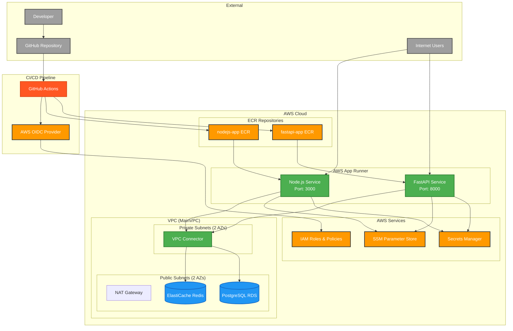
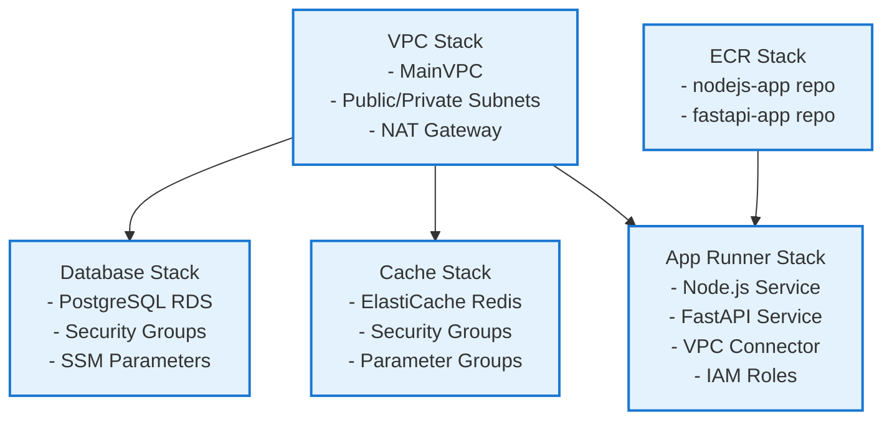

# Care Capture CDK Architecture Diagram

## System Overview
This is a microservices architecture deployed on AWS using CDK, featuring Node.js and FastAPI applications with supporting infrastructure.

## Stack Dependencies

## Component Details

### 1. **VPC Stack**
- **MainVPC**: Multi-AZ VPC with CIDR block
- **Public Subnets**: 2 subnets across AZs (CIDR /24)
- **Private Subnets**: 2 subnets with egress (CIDR /24)
- **NAT Gateway**: Single NAT for cost optimization

### 2. **Database Stack**
- **PostgreSQL RDS**: Version 15, t3.micro instance
- **Storage**: 25GB GP2 with auto-scaling disabled
- **Security**: VPC security group, publicly accessible
- **Credentials**: Auto-generated secrets in Secrets Manager
- **Parameters**: Endpoint/port stored in SSM

### 3. **Cache Stack**
- **ElastiCache Redis**: Version 7.0, t4g.micro node
- **Configuration**: Single node, TLS disabled for dev
- **Network**: Public subnets with security groups
- **Parameters**: Custom parameter group for Redis 7

### 4. **ECR Stack**
- **nodejs-app**: Repository for Node.js application
- **fastapi-app**: Repository for FastAPI application
- **Lifecycle**: Auto-delete images on stack destruction

### 5. **App Runner Stack**
- **Node.js Service**: Port 3000, latest image tag
- **FastAPI Service**: Port 8000, specific image digest
- **VPC Integration**: VPC connector for private resource access
- **Environment Variables**: Redis connection details
- **IAM**: Service roles with SSM/Secrets access

### 6. **CI/CD Pipeline**
- **GitHub Actions**: Automated deployment on develop branch
- **OIDC Authentication**: Secure AWS access without long-lived credentials
- **Multi-stage**: Test → Deploy workflow
- **CDK Operations**: Bootstrap, synth, deploy with approval bypass

## Security Configuration

### Network Security
- **VPC Isolation**: Private subnets for sensitive resources
- **Security Groups**: Restrictive inbound rules
- **NAT Gateway**: Controlled outbound internet access

### Application Security
- **IAM Roles**: Least privilege access for App Runner
- **Secrets Management**: Database credentials in Secrets Manager
- **Parameter Store**: Non-sensitive configuration in SSM

### Development vs Production
- **TLS**: Disabled for Redis in development
- **Public Access**: RDS publicly accessible for development
- **Security Groups**: Permissive rules for development ease

## Resource Naming Convention
- **Environment**: `-dev` suffix for development resources
- **Stack Prefixes**: Consistent naming across stacks
- **Export Names**: Cross-stack references with descriptive names

## Deployment Flow
1. **Code Push**: Developer pushes to develop branch
2. **CI Trigger**: GitHub Actions workflow starts
3. **Authentication**: OIDC assumes AWS role
4. **CDK Operations**: Bootstrap → Synth → Deploy
5. **Stack Deployment**: VPC → ECR → Database → Cache → App Runner
6. **Service Updates**: App Runner pulls latest images from ECR

This architecture provides a scalable, secure foundation for microservices deployment with proper separation of concerns and automated CI/CD pipeline.
